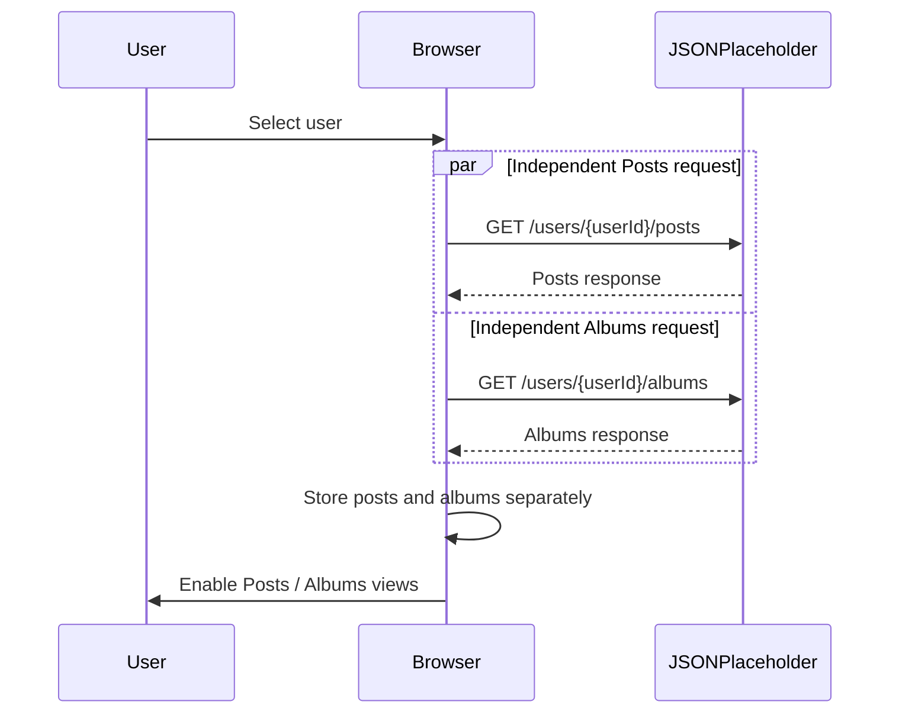

# High-Level Design
## User Posts & Albums Viewer

**Client-side web application using HTML, CSS, JavaScript and jQuery**

| Field | Value |
|---|---|
| Document Version | 0.2 |
| Status | Revised Draft - review feedback incorporated |
| Prepared By | Atul Sharma |
| Technology | HTML5, CSS3, JavaScript (ES6+), jQuery 4.0.0 |
| Data Source | JSONPlaceholder REST API |

## Revision Summary

The HLD has been updated to make Posts and Albums explicitly visible as two independent API requests in the high-level request flow. The API interface also shows complete request URLs while remaining at architecture-level detail.

## 1. Purpose

This High-Level Design defines the major components, responsibilities, external interface, and high-level request/data flows for the User Posts & Albums Viewer. It is derived from the confirmed requirements recorded in RUD v1.1 and remains above implementation-level detail.

## 2. Scope and Design Boundaries

- The solution is a client-side / presentation-layer web application.
- HTML and CSS provide the page structure and visual presentation.
- JavaScript with jQuery provides client-side interaction, API communication, response processing, and DOM updates.
- JSONPlaceholder is the only external data source currently in scope.
- No custom backend, database, authentication, or persistent storage is part of this design.

## 3. Architecture Overview

The system follows a simple client-to-external-API architecture. The browser hosts the complete application logic. The external REST API supplies user, post, and album data.

```mermaid
flowchart LR
    Browser[Browser / Client Application]
    API[JSONPlaceholder REST API]

    Browser -->|GET /users| API
    Browser -->|GET /users/{userId}/posts| API
    Browser -->|GET /users/{userId}/albums| API
```

**Figure 1. High-level component and interaction view**

## 4. Major Components

| Component | Responsibility | Key technology |
|---|---|---|
| Presentation Layer | Renders users, selected-user area, Posts/Albums controls, content, loading and error states. | HTML5 + CSS3 |
| Client-side Application Logic | Handles user interaction, API requests, HTTP success checks, JSON processing and coordination of UI updates. | JavaScript (ES6+) + jQuery 4.0.0 |
| External API | Provides user, post and album records through REST-style GET endpoints. | JSONPlaceholder |

## 5. High-Level Data / Request Flow

1. **Initial load:** The application requests the user collection from `GET https://jsonplaceholder.typicode.com/users`.
2. **User rendering:** Returned users are rendered using the API `name` value as the required first-name + last-name display value.
3. **Selection:** The user selects one displayed user.
4. **Independent user-specific retrieval:** The client starts two separate requests using the selected user ID:
   - **Request A — Posts:** `GET https://jsonplaceholder.typicode.com/users/{userId}/posts`
   - **Request B — Albums:** `GET https://jsonplaceholder.typicode.com/users/{userId}/albums`
   - The requests are independent and may execute concurrently.
5. **Response handling:** Posts and Albums are retained as separate datasets in client-side memory.
6. **Separate presentation:** The UI exposes separate Posts and Albums options; the selected option controls the displayed content area.
7. **Feedback states:** Loading is shown during retrieval; an error state is shown when a required API request fails.



**Figure 2. Explicit independent Posts and Albums request flow**

## 6. External API Interface at HLD Level

| Purpose | HTTP Method | Complete URL pattern | Used when |
|---|---|---|---|
| Retrieve users | GET | `https://jsonplaceholder.typicode.com/users` | Application initialization |
| Retrieve posts | GET | `https://jsonplaceholder.typicode.com/users/{userId}/posts` | After a user is selected — independent request A |
| Retrieve albums | GET | `https://jsonplaceholder.typicode.com/users/{userId}/albums` | After a user is selected — independent request B |

**Architecture clarification:** Posts and Albums use distinct endpoints and are represented as distinct requests. The HLD intentionally does not prescribe the exact Promise/callback mechanism; that implementation detail remains in the LLD.

## 7. Component Responsibilities and Interactions

### 7.1 Presentation Layer

- Displays the user list with first name and last name.
- Provides the user selection control.
- Provides separate Posts and Albums controls/views in the selected-user area.
- Displays loading and error feedback to the user.

### 7.2 Client-side Application Logic

- Initiates API requests using jQuery-based HTTP/AJAX operations.
- Checks whether API responses indicate success before processing returned data.
- Processes JSON responses and passes resulting data to the rendering layer.
- Tracks the selected user and coordinates the displayed Posts or Albums view.
- Coordinates independent Posts and Albums requests without combining the API calls.

### 7.3 External API Boundary

- Provides the user, post, and album records needed by the UI.
- No application-owned business database or service layer is introduced in this assignment.

## 8. Interaction Scenarios

| Scenario | Client-side flow | Result |
|---|---|---|
| Initial application load | UI initialized → GET `/users` → parse JSON → render user list | Users visible |
| User selection | Selection event → capture user ID → independent Posts request + independent Albums request | Selected-user data available after required requests succeed |
| Posts view | Posts option selected → render posts in shared content area | Only posts are shown |
| Albums view | Albums option selected → render albums in shared content area | Only albums are shown |
| API failure | Request fails or returns non-success → error handling | User-facing error message |

## 9. UI State Model

| State | When it applies | Expected UI behavior |
|---|---|---|
| Initial / Users Loading | During initial GET `/users` | Show loading indication in users area |
| Users Loaded | Users successfully retrieved | Render first-name + last-name display list |
| User Detail Loading | Posts and Albums requests are in progress after selection | Show loading indication in selected-user area |
| Posts View | Posts option selected and detail data is available | Render posts only |
| Albums View | Albums option selected and detail data is available | Render albums only |
| Error | Relevant API request fails | Show appropriate user-facing error state |

## 10. Cross-Cutting Design Considerations

### 10.1 Error Handling

- Non-success HTTP responses are treated as request failures at the client-logic layer.
- Network/request failures are surfaced to the UI through an error state.
- The user should not be left with an unexplained loading state when a request fails.

### 10.2 Loading and Feedback

- Loading feedback is associated with the requests currently in progress.
- The selected-user content area should communicate that Posts and Albums are being fetched.

### 10.3 Maintainability

- API communication, interaction handling, and DOM rendering should remain logically separated where practical.
- Endpoint construction should use the selected user ID rather than hard-coded user-specific URLs.
- Independent request behavior should remain visible at HLD level; exact coordination belongs in LLD.

### 10.4 Security / Trust Boundary

- JSONPlaceholder is an external data source and should be treated as untrusted input for rendering purposes.
- User-provided or externally returned text should be inserted using safe text-oriented DOM operations where practical, rather than unnecessary raw HTML injection.
- No application authentication or authorization is included because it is outside the confirmed assignment scope.

## 11. Performance Considerations

- The initial request retrieves only the user collection required to populate the directory.
- Posts and albums are retrieved for the selected user rather than loading unrelated users' data.
- Because Posts and Albums are independent resources, their requests may be initiated concurrently to avoid unnecessary serial waiting.

## 12. Deployment Assumption

The design assumes a static/client-side deployment capable of serving the HTML, CSS and JavaScript assets to a modern browser. The application communicates directly with JSONPlaceholder over HTTPS. No server-side application component is defined in this HLD.

## 13. HLD-to-LLD Boundary

The following items are intentionally deferred to Low-Level Design and implementation documentation:

- Exact JavaScript/jQuery function names and module/file structure.
- Detailed event-handler implementation.
- Exact DOM element hierarchy and selectors.
- Detailed AJAX option objects and Promise/callback handling.
- Exact loading/error component markup.
- Detailed validation and rendering procedures.
- Expected response examples and exact fields consumed by the UI.

## 14. Traceability to Confirmed Requirements

| Requirement | HLD coverage |
|---|---|
| Retrieve users | Presentation and client-logic components communicate with `GET https://jsonplaceholder.typicode.com/users`. |
| Display first + last name | Presentation layer owns user-list rendering; the API `name` value is treated as the required display value. |
| Select user | Presentation event flows into client-side application logic. |
| Retrieve posts | Client logic calls `GET https://jsonplaceholder.typicode.com/users/{userId}/posts` as an independent request. |
| Retrieve albums | Client logic calls `GET https://jsonplaceholder.typicode.com/users/{userId}/albums` as an independent request. |
| Separate Posts and Albums | UI state model defines distinct Posts and Albums views. |
| Loading state | Cross-cutting feedback/state model includes loading states. |
| Error handling | Client logic detects failures and presentation layer displays errors. |

## 15. Assumptions / Design Decisions

- The application is intentionally modeled as client-side only, consistent with the confirmed assignment scope.
- JSONPlaceholder is the only data source; no persistence layer is introduced.
- The UI remains simple and feature-focused because no strict visual design requirement was specified.
- Posts and Albums are separate user-selectable views in the same content area.
- Posts and Albums are separate API requests and are not modeled as a combined API operation.

## 16. Revision Notes - v0.2

| Area | Change made |
|---|---|
| Request flow | Updated the high-level flow to show two independent Post and Album API requests after user selection. |
| API interface | Added complete URL patterns for Users, Posts, and Albums. |
| Architecture boundary | Clarified that the HLD identifies independent requests, while request coordination mechanics remain an LLD concern. |
| Name display | Clarified that JSONPlaceholder exposes a single `name` field and that the full value is used as the requested first-name + last-name display. |

## 17. Document Status

**HLD v0.2 - REVISED DRAFT.** This revision incorporates the review feedback by making the independent Posts and Albums requests explicit in the high-level request flow and by making the endpoint URL patterns explicit. The document remains at architecture level and does not introduce backend, database, authentication, or persistence components.
