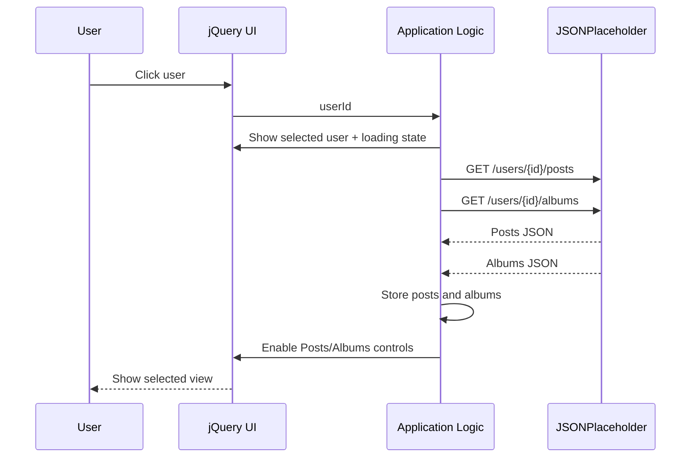
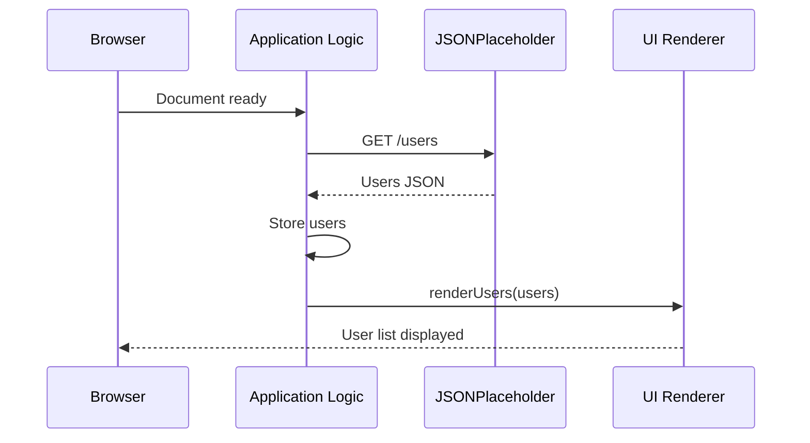

# Low-Level Design (LLD)
## User Posts & Albums Viewer

**Version:** 0.1  
**Status:** Draft  
**Prepared By:** Atul Sharma  
**Technology:** HTML5, CSS3, JavaScript (ES6+), jQuery 4.0.0  
**Data Source:** JSONPlaceholder REST API  
**Application Type:** Client-side / presentation-layer web application  

---

## 1. Purpose

This LLD translates the confirmed requirements into an implementation-level design for the User Posts & Albums Viewer. It defines the client-side modules, functions, UI structure, API interactions, data flow, state handling, and error-handling responsibilities to be implemented using HTML, CSS, JavaScript, and jQuery.

The design assumes that JSONPlaceholder is the only data source and that there is no custom backend, database, authentication system, or persistent storage.

---

## 2. Reference Requirements

The implementation shall support the following confirmed behavior:

- Retrieve users from the JSONPlaceholder `/users` endpoint.
- Display each user using first name and last name only.
- Allow the user to select/click a displayed user.
- Retrieve posts and albums associated with the selected user ID.
- Present Posts and Albums as separate views/options rather than one combined list/view.
- Display loading feedback while API data is being retrieved.
- Display an appropriate user-facing error message when an API request fails.
- Update the displayed data without requiring a full-page refresh for each user selection.

---

## 3. Proposed Project Structure

A small separation of concerns is recommended even though the application is client-side only.

```text
user-posts-albums-viewer/
│
├── index.html
├── css/
│   └── style.css
├── js/
│   ├── api.js
│   ├── ui.js
│   └── app.js
├── docs/
│   ├── RUD_User_Posts_Albums_v1.1.pdf
│   ├── SRS_User_Posts_Albums_v0.1.docx
│   ├── API_Spec_User_Posts_Albums_v0.1.docx
│   ├── HLD_User_Posts_Albums_v0.1.pdf
│   └── LLD_User_Posts_Albums_v0.1.md
└── README.md
```

### Responsibility of each file

| File | Responsibility |
|---|---|
| `index.html` | Static page structure and UI containers |
| `css/style.css` | Layout, visual styling, selected state, loading/error styling, responsive behavior |
| `js/api.js` | JSONPlaceholder HTTP requests only |
| `js/ui.js` | DOM rendering and UI state updates |
| `js/app.js` | Application flow, event handling, orchestration, and state |
| `README.md` | Setup, usage, and project overview |

The separation is intentionally lightweight. No framework, build system, backend, or state-management library is required by the current scope.

---

## 4. High-Level Runtime Flow

```mermaid
flowchart TD
    A[Document Ready] --> B[Load Users]
    B --> C[GET /users]
    C --> D[Store Users]
    D --> E[Render First Name + Last Name]
    E --> F[User Selects User]
    F --> G[Store Selected User]
    G --> H[Load Posts + Albums]
    H --> I[GET /users/{id}/posts]
    H --> J[GET /users/{id}/albums]
    I --> K[Store Posts]
    J --> L[Store Albums]
    K --> M[Enable Posts/Albums Views]
    L --> M
    M --> N[User Selects Posts or Albums]
    N --> O[Render Selected View]
```

---

## 5. Client-Side State

The application can maintain a small in-memory state object in `app.js`.

```javascript
const state = {
    users: [],
    selectedUser: null,
    posts: [],
    albums: [],
    activeView: "posts",
    loading: false,
    error: null
};
```

### State fields

| Field | Type | Purpose |
|---|---|---|
| `users` | Array | Stores retrieved user records |
| `selectedUser` | Object / null | Stores the currently selected user |
| `posts` | Array | Stores posts for the selected user |
| `albums` | Array | Stores albums for the selected user |
| `activeView` | String | Indicates the visible content view: `posts` or `albums` |
| `loading` | Boolean | Indicates an active user-specific API operation |
| `error` | String / null | Stores the current user-facing error state |

The state exists only for the current page session. No persistence is required.

---

## 6. HTML / DOM Structure

The HTML should provide stable containers that jQuery can update dynamically.

```html
<body>
    <header>
        <h1>User Posts &amp; Albums Viewer</h1>
    </header>

    <main>
        <section id="users-panel">
            <h2>Users</h2>
            <div id="users-list"></div>
        </section>

        <section id="details-panel">
            <h2 id="selected-user"></h2>

            <div id="content-controls">
                <button id="posts-btn" type="button">Posts</button>
                <button id="albums-btn" type="button">Albums</button>
            </div>

            <div id="loading-message" hidden></div>
            <div id="error-message" hidden></div>
            <div id="content-area"></div>
        </section>
    </main>
</body>
```

### Main DOM responsibilities

| Element | Responsibility |
|---|---|
| `#users-list` | Render selectable users |
| `#selected-user` | Show selected user's first and last name |
| `#posts-btn` | Activate Posts view |
| `#albums-btn` | Activate Albums view |
| `#loading-message` | Display loading feedback |
| `#error-message` | Display error feedback |
| `#content-area` | Display either Posts or Albums, but not both simultaneously |

---

## 7. API Layer (`api.js`)

`api.js` shall contain HTTP communication functions and no presentation logic.

### 7.1 Base URL

```javascript
const API_BASE_URL = "https://jsonplaceholder.typicode.com";
```

### 7.2 `getUsers()`

**Purpose:** Retrieve all users.

```javascript
function getUsers() {
    return $.ajax({
        url: `${API_BASE_URL}/users`,
        method: "GET",
        dataType: "json"
    });
}
```

**Returns:** jQuery `jqXHR`/Promise-like object resolving to an array of users.

### 7.3 `getUserPosts(userId)`

**Purpose:** Retrieve posts associated with the selected user.

```javascript
function getUserPosts(userId) {
    return $.ajax({
        url: `${API_BASE_URL}/users/${userId}/posts`,
        method: "GET",
        dataType: "json"
    });
}
```

### 7.4 `getUserAlbums(userId)`

**Purpose:** Retrieve albums associated with the selected user.

```javascript
function getUserAlbums(userId) {
    return $.ajax({
        url: `${API_BASE_URL}/users/${userId}/albums`,
        method: "GET",
        dataType: "json"
    });
}
```

### API-layer rule

API functions should return data/results to the caller. They should not directly modify the DOM or display UI messages. This keeps transport concerns separate from presentation concerns.

---

## 8. Application Logic (`app.js`)

`app.js` coordinates API calls, state transitions, user interaction, and rendering.

### 8.1 Initialization

```javascript
$(function () {
    loadUsers();
    bindEvents();
});
```

### 8.2 `loadUsers()`

**Responsibility:** Initial application data retrieval.

```text
Document ready
    ↓
loadUsers()
    ↓
getUsers()
    ↓
Success → store users → renderUsers()
    ↓
Failure → showError()
```

### 8.3 `handleUserSelection(user)`

**Responsibility:** Start the selected-user workflow.

```text
User selected
    ↓
selectedUser = user
    ↓
show selected user
    ↓
clear previous content/error
    ↓
showLoading()
    ↓
load posts + albums
```

### 8.4 `loadUserDetails(userId)`

Posts and albums are independent resources. They should be requested concurrently.

```javascript
function loadUserDetails(userId) {
    state.loading = true;
    showLoading();

    return $.when(
        getUserPosts(userId),
        getUserAlbums(userId)
    )
    .done(function (posts, albums) {
        state.posts = posts[0];
        state.albums = albums[0];
        state.loading = false;
        enableContentControls();
        renderActiveView();
    })
    .fail(function () {
        state.loading = false;
        showError("Failed to load user details.");
    })
    .always(function () {
        hideLoading();
    });
}
```

`$.when()` is used here because the two requests are independent and can be in progress at the same time.

### 8.5 `handleViewChange(view)`

**Responsibility:** Switch between Posts and Albums without re-requesting data already loaded for the selected user.

```javascript
function handleViewChange(view) {
    state.activeView = view;
    renderActiveView();
}
```

Expected values:

```text
"posts"
"albums"
```

### 8.6 `renderActiveView()`

```javascript
function renderActiveView() {
    if (state.activeView === "posts") {
        renderPosts(state.posts);
    } else {
        renderAlbums(state.albums);
    }
}
```

Only one content view is rendered into `#content-area` at a time.

---

## 9. UI Rendering Layer (`ui.js`)

`ui.js` is responsible only for DOM updates.

### 9.1 `renderUsers(users)`

**Input:** Array of users.

**Behavior:** Render first name + last name as selectable controls.

Illustrative implementation:

```javascript
function renderUsers(users) {
    const $list = $("#users-list");
    $list.empty();

    $.each(users, function (_, user) {
        const $button = $("<button>", {
            type: "button",
            class: "user-item",
            text: `${user.name.split(" ")[0]} ${user.name.split(" ").slice(1).join(" ")}`,
            "data-user-id": user.id
        });

        $list.append($button);
    });
}
```

Because the JSONPlaceholder `name` field is provided as a full display name, the implementation should treat it as the user's display name. If a strict first-name/last-name split is required beyond the current API representation, that behavior should be clarified before adding parsing rules.

### 9.2 `renderPosts(posts)`

**Responsibility:** Replace the content area with the Posts view only.

Each post should display its relevant title/body data.

```text
Content area
    ↓
Posts heading
    ↓
Post list
    ├── Post title
    │   Post body
    ├── Post title
    │   Post body
    └── ...
```

Use text insertion for API-provided values rather than inserting API values as executable HTML.

### 9.3 `renderAlbums(albums)`

**Responsibility:** Replace the content area with the Albums view only.

```text
Content area
    ↓
Albums heading
    ↓
Album list
    ├── Album title
    ├── Album title
    └── ...
```

### 9.4 Loading functions

```javascript
function showLoading() {
    $("#loading-message")
        .text("Loading...")
        .prop("hidden", false);
}

function hideLoading() {
    $("#loading-message").prop("hidden", true);
}
```

### 9.5 Error function

```javascript
function showError(message) {
    $("#error-message")
        .text(message)
        .prop("hidden", false);
}
```

A separate `clearError()` function should hide the error before a new request starts.

---

## 10. Event Handling

Events shall be bound in `app.js`.

### User selection

Because user controls are dynamically created, delegated event handling is appropriate:

```javascript
$("#users-list").on("click", ".user-item", function () {
    const userId = Number($(this).data("user-id"));
    const user = state.users.find(u => u.id === userId);

    handleUserSelection(user);
});
```

### Posts / Albums controls

```javascript
$("#posts-btn").on("click", function () {
    handleViewChange("posts");
});

$("#albums-btn").on("click", function () {
    handleViewChange("albums");
});
```

### Event flow

```text
User clicks user control
        ↓
Delegated click handler
        ↓
Read user ID
        ↓
Find user in state
        ↓
handleUserSelection(user)
        ↓
Load selected user's details
```

---

## 11. Detailed User-Selection Sequence



The two API requests are independent and should not be modeled as a dependency on each other.

---

## 12. Initial User-List Sequence



---

## 13. Error Handling Design

### Initial user request failure

```text
GET /users
   ↓
failure
   ↓
showError("Failed to fetch users.")
```

The user list remains empty or displays the error state.

### Selected-user request failure

```text
User selected
   ↓
showLoading()
   ↓
Posts/Albums request
   ↓
Failure
   ↓
hideLoading()
   ↓
showError("Failed to load user details.")
```

The application should not display stale data as if it belonged to the newly selected user.

### HTTP success validation

A successful HTTP request should be required before using the returned data. With jQuery AJAX, HTTP failures are routed through the failure callback.

---

## 14. Loading-State Design

Loading feedback is required for user-specific data retrieval and should be visible while requests are in progress.

Expected state transition:

```text
Idle
 ↓
Loading
 ↓
Success → Display selected view

Loading
 ↓
Failure → Display error
```

The loading indicator should not remain visible after the request settles.

---

## 15. Posts / Albums View Logic

The UI shall maintain a single content area with two separate choices:

```text
[ Posts ]   [ Albums ]
```

### Posts selected

```text
activeView = "posts"
       ↓
renderPosts(state.posts)
```

### Albums selected

```text
activeView = "albums"
       ↓
renderAlbums(state.albums)
```

Posts and Albums must not be rendered as one combined list or simultaneous content view.

If both datasets have already been retrieved for the selected user, changing the active view should only update the content area and should not trigger another API request.

---

## 16. Data Shapes Used by the UI

Only fields required by the UI should be consumed.

### User

```javascript
{
    id: 1,
    name: "Leanne Graham",
    ...
}
```

Relevant field:

```text
id
name
```

### Post

```javascript
{
    userId: 1,
    id: 1,
    title: "...",
    body: "..."
}
```

Relevant fields:

```text
id
title
body
```

### Album

```javascript
{
    userId: 1,
    id: 1,
    title: "..."
}
```

Relevant fields:

```text
id
title
```

---

## 17. DOM Update Rules

The renderer should follow these rules:

1. Clear or replace the target container before rendering a fresh dataset.
2. Use stable element IDs/classes for predictable targeting.
3. Use `text()`/text nodes for API-provided text where possible.
4. Do not duplicate user/post/album elements when the same rendering function is called again.
5. Replace the content area when switching between Posts and Albums.
6. Keep loading and error messages outside the main data list so they can be controlled independently.

Example:

```javascript
$("#content-area").empty();
```

should be performed before rendering a new active view into that container.

---

## 18. Concurrency and Request Behavior

When a user is selected, Posts and Albums are independent resources. The implementation should therefore initiate the two requests without waiting for one to complete before starting the other.

```text
User selection
      ↓
 ┌───────────────┬───────────────┐
 ↓               ↓
Posts request    Albums request
 ↓               ↓
Posts data       Albums data
 └───────┬───────┘
         ↓
   Store both datasets
         ↓
   Render selected view
```

For this assignment, no caching beyond the currently selected user's in-memory data is required.

---

## 19. UI State Transitions

```text
APPLICATION START
        |
        v
   LOADING USERS
      /       \
   success    failure
     |           |
     v           v
USERS READY   ERROR STATE
     |
     v
USER SELECTED
     |
     v
LOADING DETAILS
    /       \
 success    failure
   |           |
   v           v
DETAILS      ERROR STATE
READY
   |
   v
POSTS / ALBUMS VIEW
```

---

## 20. Validation Rules

The client should perform basic checks before starting user-specific requests:

- A selected user must exist.
- A valid numeric user ID must be available.
- The selected user name should be available for display.
- Empty arrays should produce a meaningful empty state rather than an empty page.

Example:

```javascript
if (!user || !user.id) {
    showError("Unable to identify the selected user.");
    return;
}
```

No business-rule validation or user-entered form validation is currently required by the scope.

---

## 21. Empty-State Handling

The current requirements explicitly include loading and errors. Empty-state handling is included in the low-level design as defensive UI behavior.

If a valid response contains no posts:

```text
No posts available for this user.
```

If a valid response contains no albums:

```text
No albums available for this user.
```

This avoids presenting a blank content area with no explanation.

---

## 22. Browser-Side Security Considerations

The application should not treat API-provided text as trusted HTML.

Prefer:

```javascript
$("<li>").text(post.title);
```

over interpolating untrusted API values into HTML strings.

No authentication secrets, API credentials, or private tokens are required for JSONPlaceholder in this assignment, so none should be embedded in the client code.

---

## 23. Traceability to Requirements

| SRS Requirement | LLD Implementation |
|---|---|
| FR-01 Retrieve users | `getUsers()` + `loadUsers()` |
| FR-02 Display users | `renderUsers()` using first and last name display |
| FR-03 Select user | Delegated click handler + `handleUserSelection()` |
| FR-04 Retrieve posts | `getUserPosts(userId)` |
| FR-05 Retrieve albums | `getUserAlbums(userId)` |
| FR-06 Separate Posts/Albums | `activeView` + `renderPosts()` / `renderAlbums()` |
| FR-07 Loading state | `showLoading()` / `hideLoading()` |
| FR-08 Error handling | `showError()` + AJAX failure handling |
| FR-09 Dynamic update | DOM rendering without full-page refresh |

---

## 24. Implementation Checklist

Before considering the implementation complete, verify that:

- [ ] `/users` is called successfully on initial load.
- [ ] First name + last name are displayed for each user.
- [ ] User selection identifies the correct user ID.
- [ ] Posts are requested for the selected user.
- [ ] Albums are requested for the selected user.
- [ ] Posts and Albums are separate UI views.
- [ ] Switching views does not combine both datasets.
- [ ] Loading feedback appears during user-specific retrieval.
- [ ] API failures produce a user-facing error.
- [ ] Empty datasets produce an appropriate empty state.
- [ ] Selecting another user replaces the previous user's data.
- [ ] No full-page refresh is required for user selection.
- [ ] No duplicate DOM items are created on re-render.
- [ ] No console errors remain during normal use.

---

## 25. Design Decisions and Boundaries

The following decisions are intentionally kept at low-level implementation scope:

- jQuery is used for AJAX communication, event handling, and DOM operations.
- API functions are separated from rendering functions.
- User-specific Posts and Albums are requested concurrently.
- The currently selected user's data is kept in memory for view switching.
- Posts and Albums share one content area but are rendered separately.
- No custom backend, database, authentication, or persistent cache is introduced.

Visual styling details remain in CSS and are not defined as low-level business logic.

---

## 26. Open Implementation Note

The confirmed requirement is that the user list display the user's **first name and last name**. JSONPlaceholder exposes a single `name` field for a user. The LLD therefore treats that API field as the display name rather than inventing a fixed parsing rule for all possible names. If the trainer expects a strict first-name/last-name parsing rule, that should be confirmed before implementation.

---

## 27. Document Status

**LLD v0.1 — Draft**

This document is intended to serve as the implementation-level design baseline after the confirmed RUD/SRS. Any subsequent requirement changes should be reflected in the RUD/SRS first and then propagated into this LLD.
